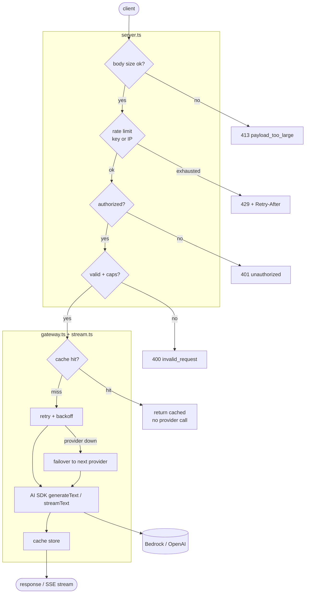

# ts-llm-gateway

[](https://github.com/young-kobe/ts-llm-gateway/actions/workflows/ci.yml)
[](./LICENSE)


A minimal but real **LLM gateway proxy** in TypeScript/Node: one unified endpoint that
routes to multiple providers behind a single interface, with production policies layered on
top: rate limiting, retry/backoff with cross-provider failover, response caching, and
streaming with client-driven cancellation.

Built on Vercel's own stack: the [`ai`](https://www.npmjs.com/package/ai) SDK for the provider
abstraction, [`@ai-sdk/amazon-bedrock`](https://www.npmjs.com/package/@ai-sdk/amazon-bedrock)
(primary) and [`@ai-sdk/openai`](https://www.npmjs.com/package/@ai-sdk/openai) (failover) as
providers, and [Hono](https://hono.dev) for the HTTP layer.

> **Status:** feature-complete. A native `POST /v1/chat` and an **OpenAI-compatible
> `POST /v1/chat/completions`** (drop-in for the OpenAI SDK, with `provider/model` routing) both
> route to both providers behind one interface, wrapped in three production policies (per-key
> **rate limiting**, **retry with exponential backoff + cross-provider failover**, and an **LRU
> response cache**), plus **SSE token streaming with client-driven cancellation**, abuse guards
> (API-key auth, IP-based rate limiting, request caps), and a **live stats dashboard** (`/stats`).
> State (cache, rate limiter, metrics) runs behind a **pluggable backend**: in-memory by default,
> or global + durable via Upstash Redis when configured. 66 tests (unit + HTTP integration) run
> without live keys; a benchmark harness measures the cache and failover paths. Deploy config for
> Vercel is included.

## Why this exists

Every feature here maps directly onto a piece of a production real-time streaming system
(RTSS) I built. The gateway is the same class of system, re-expressed as an LLM proxy:

| RTSS piece (production) | Gateway feature it becomes |
|---|---|
| Kinesis shard-polling backpressure / request admission | **Rate limiting**: token-bucket per API key/route |
| Retry/backoff on Kinesis throttling | **Retry + exponential backoff**, then **failover** to the secondary provider |
| Shard-consumer cancellation tokens | **Streaming abort**: client disconnect cancels the upstream call |
| Composite routing keys | **Provider/model routing** |
| SignalR streaming fan-out to dashboards | **SSE token streaming** to the client |

## API

### `POST /v1/chat`

Non-streaming chat completion.

```jsonc
// request
{
  "provider": "bedrock",          // optional; defaults to DEFAULT_PROVIDER
  "model": "anthropic.claude-3-5-sonnet-20240620-v1:0",
  "messages": [{ "role": "user", "content": "Hello" }],
  "temperature": 0.7,             // optional
  "maxTokens": 512                // optional
}
```

```jsonc
// response
{
  "provider": "bedrock",
  "model": "anthropic.claude-3-5-sonnet-20240620-v1:0",
  "text": "Hello! ...",
  "usage": { "inputTokens": 7, "outputTokens": 11 },
  "cached": false          // true when served from the response cache
}
```

`provider`/`model` reflect who *actually* served the response, so after a failover they name the
secondary. A `429` (with a `Retry-After` header) means the caller's rate-limit bucket is empty.

Send an API key via `x-api-key` (or a `Bearer` token) to get a per-key rate-limit bucket;
otherwise all callers share the `anonymous` bucket.

#### Streaming

Add `"stream": true` to get an SSE token stream instead of a single JSON body. Events are
`delta` (a token chunk) then a final `done` (with `provider`/`model`/`cached`/`usage`):

```
event: delta
data: {"type":"delta","text":"Hel"}

event: delta
data: {"type":"delta","text":"lo"}

event: done
data: {"type":"done","provider":"bedrock","model":"...","cached":false,"usage":{...}}
```

If the client disconnects, the gateway aborts the upstream provider call rather than letting it
run to completion. That is the RTSS cancellation-token bridge. (Streaming serves the primary
provider; retry/failover apply to the non-streaming path.)

### `POST /v1/chat/completions`

OpenAI-compatible endpoint: it accepts the OpenAI Chat Completions request and returns the OpenAI
response shape, so an existing OpenAI SDK client can point straight at the gateway by changing only
its `baseURL`. It reuses the same core as `/v1/chat` (cache, retry, failover, timeout, metrics).

Routing is driven by a `provider/model` prefix on the `model` field:

```jsonc
// request (OpenAI wire format)
{
  "model": "openai/gpt-4o-mini",   // "<provider>/<model>"; bare id → DEFAULT_PROVIDER
  "messages": [{ "role": "user", "content": "Hello" }],
  "temperature": 0.7,              // optional
  "max_completion_tokens": 512     // optional (legacy "max_tokens" also accepted)
}
```

```jsonc
// response (OpenAI chat.completion)
{
  "id": "chatcmpl-...",
  "object": "chat.completion",
  "created": 1752600000,
  "model": "openai/gpt-4o-mini",   // echoes the requested id
  "choices": [
    { "index": 0, "message": { "role": "assistant", "content": "Hello! ..." }, "finish_reason": "stop" }
  ],
  "usage": { "prompt_tokens": 7, "completion_tokens": 11, "total_tokens": 18 }
}
```

Only a *known* provider prefix (`openai/`, `bedrock/`) is stripped; a bare id or a Bedrock ARN
(which itself contains `/`) is passed through unchanged. Add `"stream": true` for an OpenAI SSE
stream: `chat.completion.chunk` frames (opening `role` delta, then `content` deltas, then a `stop`
finish) terminated by `data: [DONE]`. The same auth, rate-limit, and request caps apply.

### `GET /health`

Liveness check → `{ "ok": true }`.

### `GET /stats`

Live counters powering the dashboard on the landing page: request/success/error totals,
per-reason rejections, cache hit rate, failovers, per-provider served counts, token totals, and
provider-call latency p50/p99. Backed by Redis when configured (global) or in-memory otherwise
(per-instance); see [Abuse prevention](#abuse-prevention).

## Architecture



Providers hide behind a single `Provider` interface (`src/providers/index.ts`), so the gateway
never imports a concrete SDK. That seam is what makes routing, failover, and keyless testing
possible: tests inject a mock registry.

## Policies

Each policy is a standalone, unit-tested module in `src/policies/`, composed by the gateway in
the order above. All use injectable clocks / sleep so behavior is tested deterministically.

- **`rateLimit.ts`**: token bucket, one per caller (see [Abuse prevention](#abuse-prevention)
  for how the bucket key is chosen). Configurable capacity (burst) and refill rate; returns
  `429` + `Retry-After` when a bucket is empty.
- **`retry.ts`**: exponential backoff (`base · 2^n`, capped) per provider, then failover to the
  next provider in the chain. A provider only joins the chain if it has a fallback model
  configured, since model ids are provider-specific.
- **`timeout.ts`**: a per-provider-call deadline (`PROVIDER_TIMEOUT_MS`). A stalled call becomes a
  fast, retryable failure that triggers failover, rather than hanging until the function's max
  duration. Applies to the non-streaming path.
- **`cache.ts`**: LRU cache (optional TTL) keyed on a SHA-256 of the request identity
  (resolved provider + model + messages + params). A hit returns without any provider call.

Tuned via env vars; see `.env.example`.

## Abuse prevention

A public endpoint that spends money per call needs guarding. In-code (`src/server.ts`,
`src/policies/auth.ts`), the gateway does, in order:

1. **Body-size guard**: rejects oversized payloads (`413`) by `Content-Length` before parsing.
2. **Rate limiting**: buckets *authorized* callers by their validated key and everyone else by
   **client IP** (`x-forwarded-for`). It deliberately never buckets by the raw caller-supplied
   key, so an attacker can't rotate `x-api-key` to mint a fresh bucket per request.
3. **Auth gate**: when `GATEWAY_API_KEYS` is set, callers must present an allowlisted key
   (`x-api-key` or `Bearer`) or get `401`. Unset = open (local dev only).
4. **Request caps**: clamps `maxTokens` to `MAX_OUTPUT_TOKENS`, caps message count / content
   length, and optionally restricts models (`ALLOWED_MODELS`). Bounds the cost of any one request.

**State backend (durable or best-effort):** the rate limiter, cache, and metrics run behind a
pluggable store. Set `KV_REST_API_URL` / `KV_REST_API_TOKEN` (the Vercel Marketplace Upstash
integration injects both) and all three become
**global and durable across serverless instances** (a distributed token bucket, a shared response
cache, and shared counters). Unset, they fall back to **in-process, per-instance** state that
resets on cold start. The gateway degrades gracefully either way; nothing else changes.

Regardless of backend, set the two provider-side backstops so abuse can't run up an unbounded bill:

- **Provider spend caps**: OpenAI usage limits + AWS Budgets.
- **Vercel Firewall / Attack Challenge Mode**: edge-level IP rate limiting, complementary to the
  app-level limiter.

## Design decisions & trade-offs

The interesting part of a gateway is what you deliberately chose *not* to do.

- **Providers behind one interface, injected.** The gateway core never imports a concrete SDK;
  it takes a `Provider` registry. That single seam is what makes routing, cross-provider failover,
  and **keyless testing** (mock registry) all fall out for free. Every test runs with no live keys.
- **Exact-match cache, not semantic.** Keys are a SHA-256 of the request identity (provider +
  model + messages + params). It's cheap, deterministic, and can never return a "close but wrong"
  answer; the cost is that only verbatim repeats hit (retries, idempotent re-sends, evals, load
  tests), not paraphrases. Semantic caching would trade correctness guarantees for hit rate; not
  worth it here.
- **Pluggable state backend, in-memory by default.** The cache, rate limiter, and metrics each sit
  behind a small interface with two implementations: in-process, and Redis-backed for a global,
  durable view across instances. It defaults to in-memory (zero infra, correct for low traffic) and
  upgrades to shared state purely by setting Redis env vars, degrading gracefully if they're absent.
  The interface seam is what made this a drop-in rather than a rewrite.
- **Rate-limit bucketing by validated-key-or-IP**, never the raw caller-supplied header, since
  otherwise rotating `x-api-key` mints a fresh bucket per request and the limit is meaningless.
- **Streaming serves the primary provider only.** Retry/failover apply to the non-streaming path;
  failing over mid-stream after tokens are already sent to the client isn't safe, so it's out of
  scope by design rather than by omission.
- **`maxTokens` clamped before the cache key is computed**, so requests asking for 5000 vs 2000
  tokens normalize to the same capped value and can share a cache entry.

## Production next steps

Deliberately out of scope for this artifact, in rough priority order:

- **Per-key usage quotas / billing** on top of the shared Redis store (the store itself is built;
  see [Abuse prevention](#abuse-prevention)).
- **Request coalescing (single-flight)**: collapse concurrent identical in-flight requests into
  one upstream call (the cache only dedupes *sequential* repeats, not simultaneous ones).
- **Streaming timeouts**: a time-to-first-token deadline for the SSE path (the non-streaming path
  already has a per-call timeout).
- **Usage to cost accounting**: tokens × per-model price, surfaced per request and in aggregate.
- **Structured logging + tracing** (request id, provider, latency, cache hit, tokens).

## Develop

```bash
npm install
npm test          # runs the integration suite with mock providers (no keys needed)
npm run typecheck
cp .env.example .env   # fill in AWS + OpenAI creds to run against live providers
npm run dev            # serves the API + landing page/dashboard at http://localhost:8787
```

`npm run dev` also serves `public/` (landing page + live dashboard) so the full experience is
viewable locally; in production Vercel serves those static files itself.

## Benchmarks

Measured with `npm run bench`. **Honesty note:** these run without live provider keys, against
a mock backend with a fixed injected latency (120 ms). So the numbers are real measurements of
*the gateway itself*: cache-hit vs. cache-miss overhead and failover behavior, not of any real
model. Re-run against live Bedrock/OpenAI after deploy for end-to-end provider latency.

Simulated 120 ms backend, 200 iterations:

| Path | p50 | p99 | mean |
|---|---|---|---|
| cache **miss** (full backend round-trip) | 120.78 ms | 121.69 ms | 120.93 ms |
| cache **hit** (in-process hash + LRU lookup) | 0.003 ms | 0.012 ms | 0.004 ms |

- A miss costs the full backend round-trip; a hit avoids the provider call entirely and is
  served in-process at sub-millisecond p99.
- **Failover demo:** with the primary forced down, the request failed over and was **served by
  `openai` in 413 ms** (two failed primary attempts × 120 ms + 50 ms backoff + one 120 ms
  secondary call).

## Deploy (Vercel)

`api/index.ts` wraps the Hono app in the Node.js Vercel adapter
(`@hono/node-server/vercel`, not `hono/vercel`, which is the Edge/Web adapter) and
`vercel.json` rewrites all routes to that one function. `framework: null` keeps Vercel from
also treating `src/` as a server entrypoint. To ship it under your own account:

```bash
npm i -g vercel
vercel                 # link + deploy a preview
# set env vars (AWS_*, OPENAI_API_KEY, *_FALLBACK_MODEL, policy knobs) in the dashboard
vercel --prod          # deploy production, capture the live URL
```

- Live URL: https://ts-llm-gateway.vercel.app/

## License

[MIT](./LICENSE) © Kobe Young
